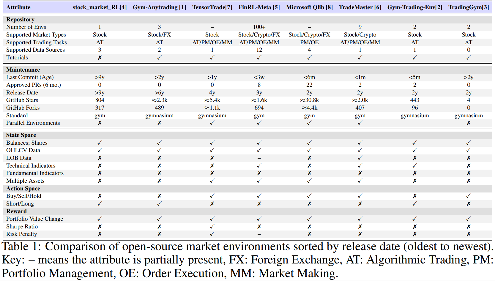

=================================================
Overview
=================================================

In recent years, financial reinforcement learning (FinRL) with deep reinforcement learning (DRL)
has shown huge potentials in obtaining profitable trading strategies in complex market conditions.
The inherently noisy and complex real-world markets makes DRL a compelling approach to adapt
and learn the optimal trading strategy. However, to effectively learn from the noisy market data,
market environments are essential to provide a close-to-real simulation of complex markets.

Despite the importance, many open-source market environments have remained outdated and in-
consistently maintained. Differences in data sources and API design hinder reproducibility and
makes it difficult to integrate and test agents across environments. Moreover, community initiatives
such as FinRL Contests require standardized market environments to ensure fair and reproducible
evaluation of agents. The challenges highlights the demand to organize current open-source market
environments

.. [1] AminHP. *gym-anytrading: A collection of OpenAI Gym environments for reinforcement learning-based trading.*, 2025.  
   URL https://github.com/AminHP/gym-anytrading. GitHub repository, MIT license. Accessed 2025-08-20.

.. [2] ClementPerroud. *Gym-Trading-Env: A simple, easy, customizable Gymnasium environment for trading.*, GitHub repository, 2025.  
   URL https://github.com/ClementPerroud/Gym-Trading-Env. Accessed 2025-08-20.

.. [3] drlove2002. *"reliance.csv" from TradingGym repository: Stock price dataset for reinforcement learning environment.*, GitHub file in drlove2002/TradingGym repository, 2025.  
   URL https://github.com/drlove2002/TradingGym/blob/master/trading_gym/data/reliance.csv. Accessed 2025-08-20.

.. [4] kh-kim. *stock_market_reinforcement_learning: Stock trading environment using OpenAI Gym with deep Q-learning and policy gradient.*, GitHub repository, 2025.  
   URL https://github.com/kh-kim/stock_market_reinforcement_learning. Accessed 2025-08-20.

.. [5] Xiao-Yang Liu, Ziyi Xia, Jingyang Rui, Jiechao Gao, Hongyang Yang, Ming Zhu, Christina Wang, Zhaoran Wang, and Jian Guo.  
   *FinRL-Meta: Market environments and benchmarks for data-driven financial reinforcement learning.*  
   *Advances in Neural Information Processing Systems*, volume 35, pages 1835–1849, 2022.

.. [6] Shuo Sun, Molei Qin, Wentao Zhang, Haochong Xia, Chuqiao Zong, Jie Ying, Yonggang Xie, Lingxuan Zhao, Xinrun Wang, and Bo An.  
   *TradeMaster: A holistic quantitative trading platform empowered by reinforcement learning.*  
   *Advances in Neural Information Processing Systems*, volume 36, pages 59047–59061, 2023.

.. [7] tensortrade-org. *TensorTrade: An open-source reinforcement learning framework for trading.*, GitHub repository, 2021.  
   URL https://github.com/tensortrade-org/tensortrade/tree/master. Accessed 2025-08-20.

.. [8] Xiao Yang, Weiqing Liu, Dong Zhou, Jiang Bian, and Tie-Yan Liu.  
   *Qlib: An AI-oriented quantitative investment platform.*, 2020.  
   URL https://arxiv.org/abs/2009.11189.

    