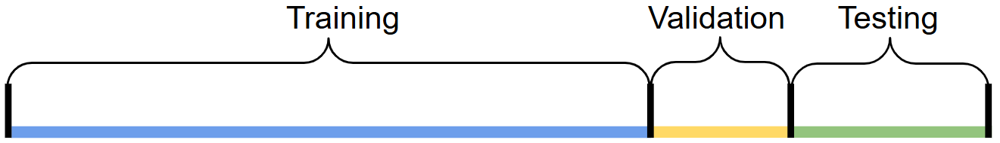

Environments for Stock Trading Task
===================================

.. toctree::
   :maxdepth: 1

   finrlmeta
   gymanytrading

Evaluation Pipeline for Stock Market Environments
-------------------------------------------------

To isolate the effect of environment design on agent performance, the evaluation is conducted on a single-asset stock trading task, with all non-environmental factors held constant (data, agent, training protocol, seeds, and evaluation metrics).  
The transaction cost for both buy and sell operations is set to **0.1%**.

Data Preprocessing
------------------

We load daily OHLCV data of **Apple Stock (AAPL)** from Yahoo Finance and apply a standardized preprocessing pipeline.  
This includes:

- Filling missing values.  
- Adding technical indicators such as **Moving Average Convergence Divergence (MACD)** and **Relative Strength Index (RSI)**.  
- Adding **turbulence indexes** to the dataset.  

The dataset is divided into **training**, **validation**, and **testing** sets, as illustrated in Figure 1.  
The time spans are as follows:

- Training set: 01/01/2009 - 12/31/2021  
- Validation set: 01/01/2022 - 12/31/2022  
- Testing set: 01/01/2023 - 12/31/2024

   Illustration of data splitting.

Training, Validation, and Testing
---------------------------------

The **Proximal Policy Optimization (PPO)** algorithm is employed to train the agent through interactions with the training set.  
The validation set is used for correctness checks and hyperparameter selection,  
while the final performance is reported on the testing set.

Comparison
-----------

To assess the effectiveness of each environment, trading results are compared against established baselines, including:

- **Dow Jones Industrial Average (DJIA) index**  
- **Equal-weight strategy**  
- **Mean-Variance Portfolio Allocation Strategy**

Performance is compared across several metrics:

- **Cumulative return**  
- **Annualized return**  
- **Annualized volatility**  
- **Sharpe ratio**  
- **Maximum drawdown**

Code for the evaluation pipeline can be found  
`Here <https://github.com/Open-Finance-Lab/FinAI-Contest/tree/main/finai_contest/pipeline>`_

